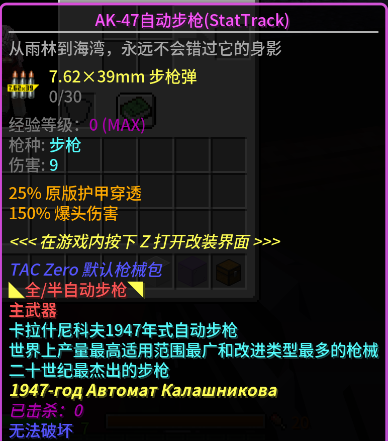

# DESOLATE KILL INFORMATION  

---  

## *击杀信息*  

<b>击杀提示</b>

- 可自定义全服提示或仅在当前世界提示：`只给相同世界的玩家发送信息`
> 鼠标悬浮在物品上可显示物品详细信息

<b>击杀记录</b>

- 记录击杀信息到 `data.yml`
- 可对接 [`Kookbot`](https://github.com/DESOLATE-CRG/DESOLATE-KookBot-MC) 在KOOK频道内查询击杀信息
> 物品需要有Display Name才可记录击杀信息

<b>物品击杀追踪</b>

- 记录物品的击杀数并保存显示在lore上
- 对接 [`Vault`](https://github.com/MilkBowl/Vault) 
- command: `/kf killtrack`
> 需要花费经济为物品解锁该功能：更改 `config.yml` 的 `击杀记录` 可自定义解锁该功能需要花费的经济

